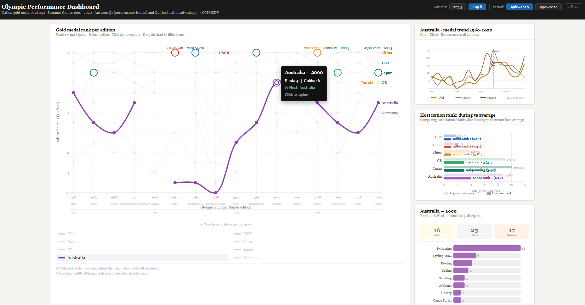

# Olympic Performance Dashboard

An interactive data visualization dashboard built with D3.js (v7), analysing Summer Olympic Games performance from 1960 to 2020.



🔗 **[Live Demo](https://rutuja1193.github.io/olympic-performance-dashboard/)**

It answers two research questions:
- **Q1** — How have nation gold medal rankings evolved across Summer Olympic editions from 1960 to 2020?
- **Q2** — Does hosting the Olympic Games confer a measurable advantage in gold medal performance?

## Features

### Four Coordinated Panels
| Panel | Visualization | Purpose |
|-------|--------------|---------|
| 1 | Bump chart | Gold medal rank per nation per edition (main view) |
| 2 | Multi-line medal trend | Gold · Silver · Bronze over time for selected nation |
| 3 | Host effect bar chart | Host-year rank vs average non-host rank for all hosting nations |
| 4 | Discipline breakdown | Top medal-winning disciplines for selected nation and year |

### Interactions
- **Hover** any dot → tooltip showing rank, gold count, host city, boycott context
- **Click** any dot → updates all three detail panels simultaneously
- **Drag** on the X-axis brush → zoom into a year range
- **Click** nation line or legend → highlight one nation, fade others
- **Top N filter** → switch between Top 5 and Top 8 nations
- **Period filter** → full 1960–2020 or post-Soviet 1992–2020
- **Reset** → restore default view

## Data Sources

| File | Description | Rows |
|------|-------------|------|
| `olympic_medals.csv` | Every medal awarded Athens 1896 – Beijing 2022 | 21,697 |
| `olympic_hosts.csv` | Host city, country, year per edition | 53 |

**Source:** Olympics.com historical records via Kaggle  
([piterfm/olympic-games-medals-19862018](https://www.kaggle.com/datasets/piterfm/olympic-games-medals-19862018))

## Data Processing

All processing happens in the browser via `d3.csv()` — no pre-processed files:

1. Host lookup table built from `olympic_hosts.csv`
2. Filter to Summer Games, year ≥ 1960
3. Deduplicate gold medals by `(slug_game + event_title + country_name)` — prevents team events inflating counts
4. Aggregate gold counts across all competing nations for correct global ranking
5. Compute ordinal ranks per edition (rank 1 = most golds)
6. Extract medal type breakdown (G/S/B) per nation per year
7. Aggregate discipline medal counts for detail panel

## Running Locally

> **Important:** Must be served via HTTP — do not open `index.html` directly by double-clicking.

```bash
cd olympic-dashboard
python3 -m http.server 8000
```
Then open [http://localhost:8000](http://localhost:8000) in Chrome.

## Tech Stack

- **D3.js v7.8.5** — all visualizations drawn as SVG
- **Vanilla JavaScript** — no frameworks
- **HTML/CSS** — single self-contained file

## Project Structure

```
olympic-dashboard/
├── index.html           ← D3 webapp 
├── data/
│   ├── olympic_medals.csv    ← medals dataset
│   ├── olympic_hosts.csv     ← hosts dataset
│   ├── olympic_athletes.csv     
│   ├── olympic_results.csv     
│   ├── summer_paralympics.csv     
│   ├── winter_paralympics.csv                 
├── figures/
└── README.md
```

---
